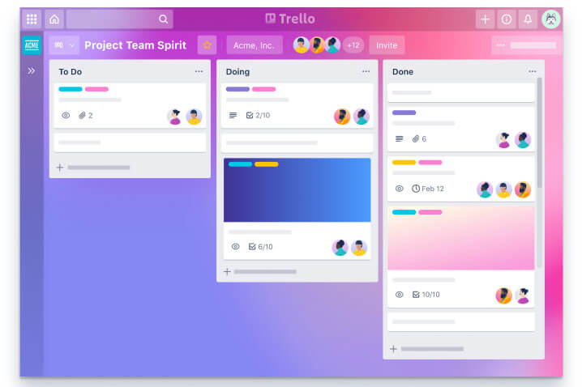
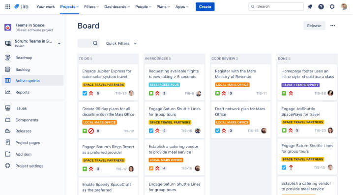
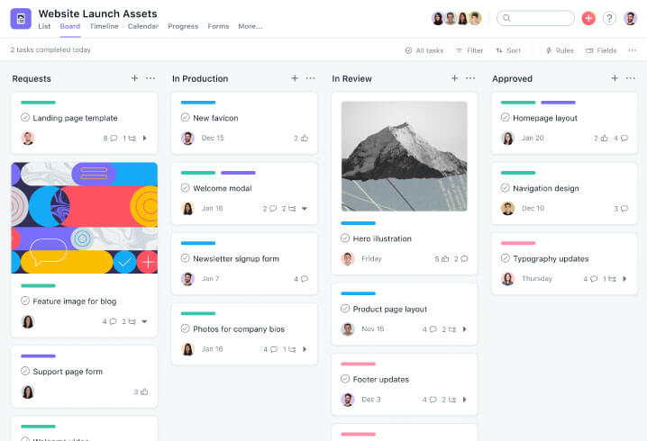

# Ferramentas kamban

```
Dentre inúmeras técnicas para gestão da qualidade utilizadas atualmente, a ferramenta Kanban tem crescido bastante. Isso ocorre, em grande parte, devido a sua simples usabilidade e as diferentes aplicações que pode ter dentro de uma empresa. 

Desse modo, torna-se útil tanto para líderes quanto para colaboradores da linha de produção. Por meio do Kanban tem-se uma visão geral dos processos, o que facilita a compreensão da ordem cronológica e prioritária, reduzindo, assim, riscos de atrasos ou estoques indevidos na indústria.

Sabendo disso, explicaremos aqui tudo sobre o que é a ferramenta Kanban, como ela funciona, quando usá-la e como utilizá-la. Além disso, listamos cinco vantagens que ela proporciona:

    * Simplicidade e praticidade de uso;

    * Clareza na visualização das atividades;

    * Fortalecimento da união entre a equipe;

    * Fluxo de trabalho mais eficiente;

    * Melhor visualização e estabelecimento das metas.
```

## O que é e para que serve a ferramenta *Kanban*?

```

A ferramenta Kanban faz parte da famosa metodologia JIT, sigla para Just in Time, que foi criada em 1960 pela empresa japonesa Toyota com o objetivo de instruir a produção de uma companhia a trabalhar conforme a demanda imediata. Dessa forma, evita-se o acúmulo de grandes estoques que ficam guardados e podem gerar prejuízos.

```

## Principais tipos de *Kanban*
```

A ferramenta Kanban possui dois tipos principais que têm diferenças em sua aplicação. Conheça esses dois modelos:

* Kanban de produção
* Kanban de movimentação
```


## 3 boas ferramentas *Kanban*
```
O Kanban é uma ferramenta que pode ser utilizada com poucos recursos. Folhas de papel e caneta são suficientes para montar o seu quadro. Contudo, existem ferramentas digitais que tornam o seu uso ainda mais prático. Conheça as principais:

    * Trello
    * Jira
    * Asana


```

## Trello


```
O Trello é uma ferramenta muito popular para a gestão de tarefas e organização de equipes. O seu funcionamento é totalmente baseado na ferramenta Kanban, pois conta com quadros que podem ser personalizados da maneira que você desejar.

É uma ótima opção para organizar as atividades do seu dia a dia ou do seu time de forma simples e prática. A plataforma é muito intuitiva, contando com uma interface simples que facilita a utilização.

```


## Jira

```
O Jira é uma ferramenta voltada à gestão de equipes ágeis que trabalham no desenvolvimento de softwares. Contudo, pode ser adaptada para times de diversas áreas.

Ele também conta com quadros Kanban simples e intuitivos que possibilitam organizar as tarefas da forma desejada. No entanto, possui uma série de outras soluções, como o quadro Scrum e o roteiro de produção.

```


## Asana

```
A Asana é uma ferramenta que tem o objetivo de reunir tudo que é preciso para gerenciar equipes em um único lugar. Por isso, possibilita a organização visual de fluxos de trabalho, planejamento de tarefas e muito mais.

Nesse conjunto de soluções, encontra-se o quadro Kanban que, assim como as outras duas ferramentas apresentadas, possui uma interface intuitiva e simples, facilitando o seu uso.

```


## Fontes 
Documentação sobre [Ferramentas Kanban](https://caetreinamentos.com.br/blog/ferramentas/ferramenta-kanban/)


